 

## 🧿 About me

I'm an IT student from the Czech Republic and a self-taught developer. I mostly build **websites** and **tools for gamers** — Discord bots, server tooling, small apps that scratch my own itch when I'm playing.

I don't do this for money or as a business. I build stuff because I need it, and then I share it here so other people don't have to build it from scratch too. Everything I publish is **free and open source**, no strings attached.

 

## ⚙️ What I do

- 🌐 **Websites** — clean, minimalist, dark-themed frontends built from scratch
- 🎮 **Tools for gamers** — Discord bots, server utilities, small QoL apps for the games I actually play
- 🖥️ **Homelab tinkering** — self-hosting, servers, automation
- 🧪 **Random projects** — whatever I'm curious about at the moment

 

## 🛠️ Tech I use

 

## 📊 Stats

 

## 🔗 Connect

 

<i>Building in silence, shipping when it's ready.</i>

